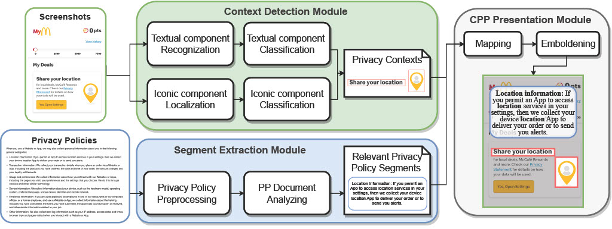

# Contextual Privacy Policies for Mobile Apps

This repository is for the project Contextual Privacy Policies for Mobile Apps.  

🚀 To the best of our knowledge, we are the first to propose a novel framework, i.e., **SeePrivacy**, to automatically generate contextual privacy policies for mobile apps.

🥳 We propose a novel multi-modal framework designed to automatically generate contextual privacy policies for mobile app. We utilize computer vision techniques and NLP techniques to extract corresponding segments from the privacy policy document.

👏 We also build the benchmark dataset, i.e., **Cpp4App**, for contextual privacy policies on mobile apps, including 600+ CPPs with their corresponding privacy policy segments.  

We build a demo website for SeePrivacy: https://cpp4app.github.io/SeePrivacy/

## Overview

## Dependency

python 3.7

opencv-python==4.6.0.66

openai==0.27.6

paddleocr==2.5.0.3

paddlepaddle==2.3.1

beautifulsoup4==4.11.1

stanza==1.5.0

## Folder Structure

- `code/SEM`: Segment Extraction Module of SeePrivacy

- `code/CDM`: Context Detection Module of SeePrivacy

- `dataset/`: Cpp4App Dataset

## How to Use

- To run segment extraction module, modify the input privacy policy path in `code/SEM/P1_PP_processing.py`and run the file. The output will be saved in **txt**.

- To run context detection module, modify the input image path in `code/CDM/run_batch.py` and run the file. The output will be saved in **result_classification**.
  
  Note: You may replace the OpenAI API Key in `code/CDM/detect_classify/classification.py` with your own key to enable ChatGPT-3.5.

<!--
**Cpp4App/Cpp4App** is a ✨ _special_ ✨ repository because its `README.md` (this file) appears on your GitHub profile.

Here are some ideas to get you started:

- 🔭 I’m currently working on ...
- 🌱 I’m currently learning ...
- 👯 I’m looking to collaborate on ...
- 🤔 I’m looking for help with ...
- 💬 Ask me about ...
- 📫 How to reach me: ...
- 😄 Pronouns: ...
- ⚡ Fun fact: ...
-->

## Dataset

For a detailed description of our benchmark dataset, please refer to `dataset/README.md`.
